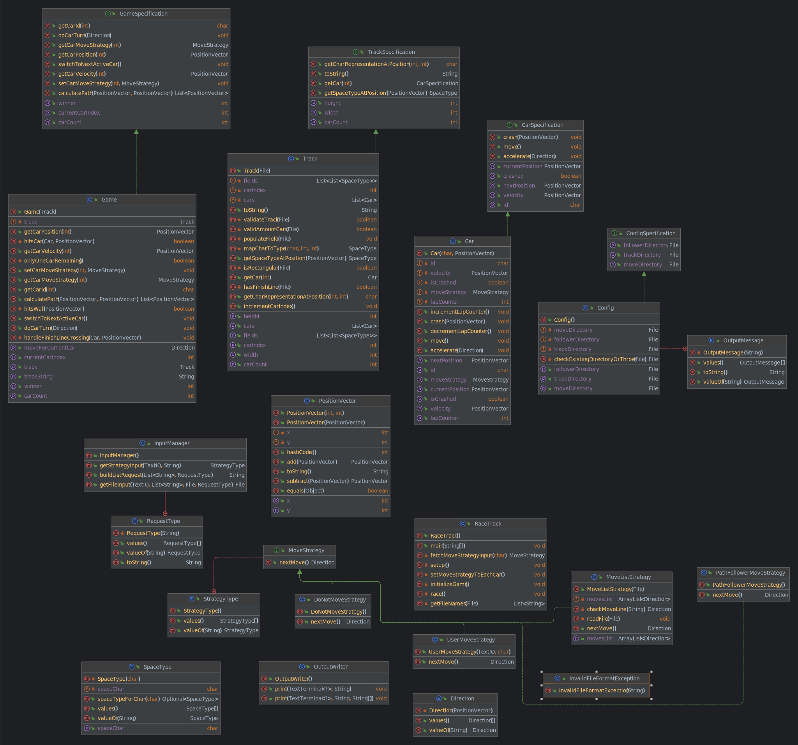

<h1 align="center"> Race Track </h1> <br>

## Table of Contents

- [Introduction](#introduction)
- [Getting started](#getting-started)
- [Game instructions](#game-instructions)
- [Game schedule](#game-schedule)
- [Class diagram](#class-diagram)
- [Contributors](#contributors)

## Introduction

Racetrack is an old strategy game for two and more
players, which simulates a car race on a squared paper.

## Getting started

### Requirements

a running java installation

### How to run

```shell
$ gradle run
```

### Game phases
#### 1. Setup phase

In this phase, the desired race track can be selected.
Subsequently, the movement strategies of the individual cars are determined individually.

#### Race track
There are already different race tracks. However, you can create your own race tracks.
The race tracks are saved as a text file in the `tracks` folder.

Following chars are allowed for a race track:
<li>WALL : '#'</li>
<li>TRACK: ' '</li>
<li>FINISH_LEFT : '&lt;'</li>
<li>FINISH_RIGHT: '&gt;'</li>
<li>FINISH_UP : '^'</li>
<li>FINISH_DOWN: 'v'</li>

#### Move strategy

There are five move strategies: `DO_NOT_MOVE`, `USER, MOVE_LIST`, `PATH_FOLLOWER`, `PATH_FINDER`.

###### DO NOT MOVE
The car does not move with this setting and stays in place

###### USER MOVE LIST
For this purpose a given file with directions is read in and used

###### PATH FOLLOWER
The car follows a predetermined route

###### PATH FINDER
The car searches for the most efficient route from the starting position to the finish line and follows this route

#### 2. Playing phase
Every car executes its move strategy and follows the given route.
This process is repeated for every car until the game ends.

#### 3. Game end
The game ends as soon as someone has crossed the finish line or is the last one who hasn't crasehd.
Likewise, the game ends when all cars use a `DO NOT MOVE` strategy or all cars that are not yet crashed use the `DO NOT MOVE` strategy.

## Branching Model
There are two write protected branches which can only be accessed by way of a pull request. The main branch is thought of as the productive branch and the dev branch is used to synchronise the development efforts of the indiviual contributor. To implement a new feature, we require that a new feature branch is created. To get a pull request accepted into the dev branch, the feature needs to be clean, tested and documented.


## Classdiagram


## Contributors
[Tim Müller](https://github.zhaw.ch/muellti3) \
[Raphael Meierhans](https://github.zhaw.ch/meierr06)\
[Ivan Starčević](https://github.zhaw.ch/starciva) \
[Philipp Kiss](https://github.zhaw.ch/kisphi01)
